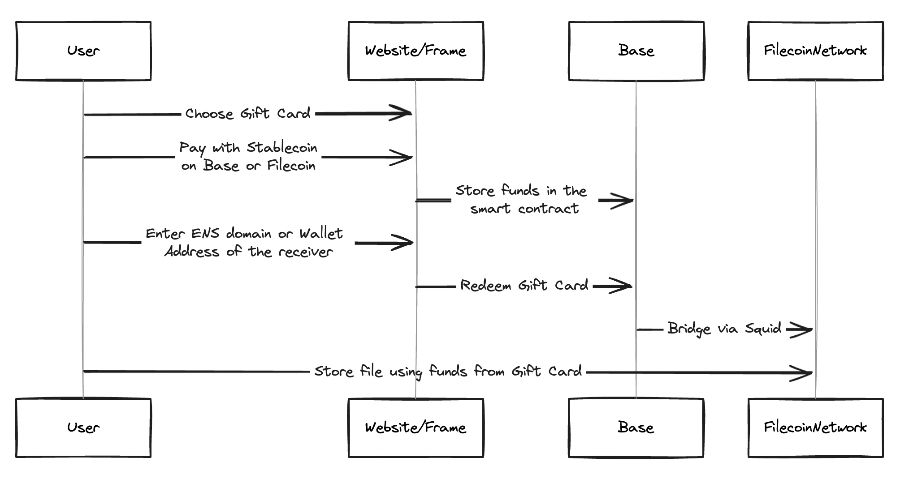

## Giftwrap

GiftWrap is a platform that allows users to gift Filecoin storage to others using gift cards, paid for with stablecoins or native ETH on Base, bridging the gap between different blockchain networks.

### Description

With GiftWrap, users can easily purchase and send gift cards that represent Filecoin storage to anyone, anywhere in the world. The platform is built on the Base blockchain, allowing users to pay for their gift cards using either stablecoins or native ETH.

The core functionality of GiftWrap revolves around the creation, redemption, and bridging of gift cards. Users can choose to pay for their gift cards using either stablecoins or native ETH on the Base blockchain. The gift cards are represented as unique NFTs, each containing metadata that showcases the redeemable storage amount and the GiftWrap branding. Recipients can be specified using their ENS domain or wallet address.

Recipients of GiftWrap gift cards can easily redeem their storage via the GiftWrap website. The platform handles the bridging of funds from the Base blockchain to the Filecoin network, allowing users to seamlessly store their files using the gift card balance.

GiftWrap aims to make decentralized storage more accessible and user-friendly by introducing a familiar concept – gift cards – to the blockchain ecosystem. By enabling users to gift storage to others and leveraging the benefits of the Base blockchain, GiftWrap increases the adoption and growth of Filecoin.

### How It's Made

The core functionality is implemented using Solidity smart contracts, which handle the creation, management, and redemption of gift cards. The smart contracts are deployed on the Base blockchain and FEVM.

The gift cards themselves are represented as ERC-721 non-fungible tokens (NFTs). Each gift card NFT contains metadata that includes the redeemable storage amount and unique branding elements. The metadata is dynamically generated using SVG and Base64 encoding techniques, allowing for visually appealing and informative gift card designs.

To facilitate the bridging of funds from the Base blockchain to Filecoin, GiftWrap integrates with Squid, a cross-chain bridging solution. When users redeem their gift cards, the smart contract interacts with the Squid bridge to securely transfer the funds to the Filecoin network, enabling users to store their files using the redeemed storage balance.

The website provides a user-friendly interface for purchasing gift cards, entering recipient information (either ENS domain or wallet address), and redeeming storage.
